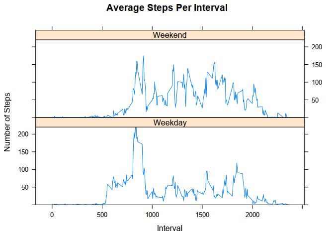

## Introduction
 The goal is to use the data to answer a specific set of questions. The data is steps taken by interval over a specific set of dates.


### Loading the libraries needed


```r
library(sqldf)
library(ggplot2)
library(lattice)
```

### Loading the csv


```r
fit_data = read.csv("activity.csv")
```


### Getting total steps per day
* Use sql to get the date and total steps per date
* Create a histogram of the data, and run mean and median functions
* Run the median function over the steps in the dataset
* Run the mean function over the steps in the dataset


```r
steps <- sqldf("select date, sum(steps) as steps 
               from fit_data 
               where steps <> 'NA' 
               group by date")
steps$steps <- as.numeric(steps$steps)
ggplot(steps, aes(x=date, y=steps, fill=steps)) + 
  geom_histogram(stat="identity") + 
  theme(axis.text.x = element_text(angle = 90, hjust = 1), 
        plot.title = element_text(lineheight=.8, face="bold")) + 
  ggtitle("Total Steps Taken by Date")
```

 

```r
median(steps$steps)
```

```
## [1] 10765
```

```r
mean(steps$steps)
```

```
## [1] 10766.19
```


### Getting the average daily activity pattern
* Use sql get the average steps per interval, then make sure R knows they are numeric
* Use xyplot to create the graph of average steps per interval
* Select the max element from our dataset


```r
average <- sqldf("select interval, avg(steps) as average 
                 from fit_data 
                 where steps <> 'NA' 
                 group by interval")
average$average <- as.numeric(average$average)
xyplot(average ~ interval, 
       ylim=c(0,220), 
       data = average, 
       type = "l", 
       main = "Average Steps Per Interval", 
       xlab = "Interval", 
       ylab = "Number of Steps")
```

 

```r
sqldf("select max(average), interval 
      from average")
```

```
##   max(average) interval
## 1     206.1698      835
```


### Replacing NA values with the average values for those intervals
* Run the sum over the is.na function to find total number of NAs
* Use sql to get average of steps by interval, and making sure R knows the averages are numeric
* Find all the missing values in the first dataset and join it onto the averages 
* Select out only the averages for all missing internals
* Create a copy of the original dataset and overwrite the NA values with the new pulled averages
* Use sql to pull the new averages per date from the newly create NA free dataset
* Use ggplot to create a graph of the new averages per date
* Use the mean and median functions to find how the NA free dataset compares to the one with NAs


```r
sum(is.na(fit_data$steps))
```

```
## [1] 2304
```

```r
average <- sqldf("select interval, avg(steps) as average 
                 from fit_data 
                 where steps <> 'NA' 
                 group by interval")
average$average <- as.numeric(average$average)
missing <- fit_data[is.na(fit_data$steps),]
found <- sqldf("select average as steps, date, m.interval from 
               missing m inner join average a 
               on m.interval = a.interval")
no_na_data <- fit_data
no_na_data[is.na(fit_data$steps),] <- found
sum(is.na(no_na_data$steps))
```

```
## [1] 0
```

```r
no_na_steps <- sqldf("select date, sum(steps) as steps 
                     from no_na_data 
                     group by date")
ggplot(no_na_steps, 
       aes(x=date, y=steps, fill=steps)) + 
  geom_histogram(stat="identity") + 
  theme(axis.text.x = element_text(angle = 90, hjust = 1), 
        plot.title = element_text(lineheight=.8, face="bold")) + 
  ggtitle("Total Steps Taken by Date")
```

 

```r
median(no_na_steps$steps)
```

```
## [1] 10766.19
```

```r
mean(no_na_steps$steps)
```

```
## [1] 10766.19
```

The mean is different, the median remains the same. 


### Finally, compare activity patterns between Weekday and Weekend
* Make sure the date column is a Date type in R
* Use the weekend function on the date column and insert it into the dataframe as a new column
* Use sql to create a new dataframe with Weekday and Weekend values for each date
* Use sql to create an average steps per date with a factor of part of week
* Use lattice to plot the Average Steps Per Interval factored by part of week


```r
fit_data$date <- as.Date(fit_data$date)
fit_data$day <- weekdays(fit_data$date, abbreviate=TRUE)
weekday <- sqldf("select *, 'Weekend' as week_part 
                 from fit_data 
                 where day in ('Sat','Sun') 
                 union all 
                 select *, 'Weekday' as week_part 
                 from fit_data 
                 where day not in ('Sat','Sun')")
weekday_avg <- sqldf("select interval, week_part, avg(steps) as average 
                     from weekday 
                     where steps <> 'NA' 
                     group by interval, week_part")
weekday_avg$average <- as.numeric(weekday_avg$average)
weekday_avg$week_part <- as.factor(weekday_avg$week_part)
xyplot(average ~ interval | week_part, 
       layout=c(1,2), 
       ylim=c(0,220), 
       data = weekday_avg, 
       type = "l", 
       main = "Average Steps Per Interval", 
       xlab = "Interval", 
       ylab = "Number of Steps")
```

 
